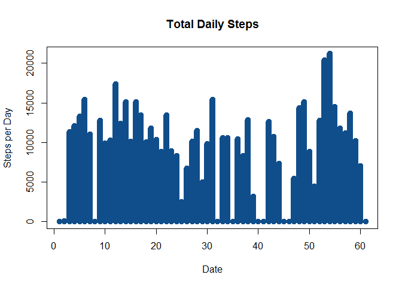
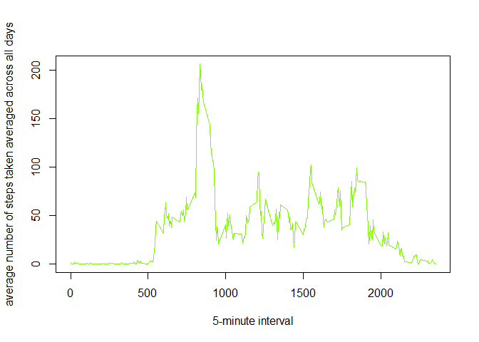
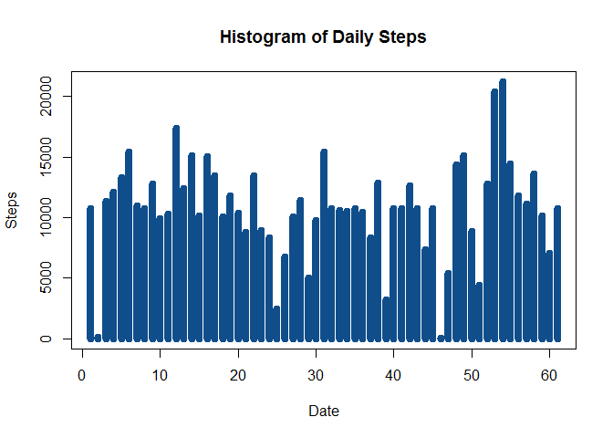

# Reproducible Research: Peer Assessment 1

## Loading and preprocessing the data


```r
unzip(zipfile="activity.zip")
data <- read.csv("activity.csv")
```

What is mean total number of steps taken per day?


```r
total.steps <- tapply(data$steps, data$date, FUN=sum, na.rm=TRUE)
plot(total.steps, type="h", main="Total Daily Steps", 
     xlab="Date", ylab="Steps per Day", col="dodgerblue4", lwd=10)
```

 

```r
mean(total.steps, na.rm=TRUE)
```

```
## [1] 9354.23
```

```r
median(total.steps, na.rm=TRUE)
```

```
## [1] 10395
```

What is the average daily activity pattern?


```r
averages <- aggregate(x=list(steps=data$steps), by=list(interval=data$interval),
                      FUN=mean, na.rm=TRUE)
plot(averages, type = "l", xlab="5-minute interval", 
     ylab="average number of steps taken averaged across all days", col ="lawngreen")
```

 

maximum number of steps


```r
averages[which.max(averages$steps),]
```

```
##     interval    steps
## 104      835 206.1698
```

Total NAs


```r
sum(is.na(data$steps))
```

```
## [1] 2304
```

Imputing missing values
Replaced NAs with the mean value of its 5-minute interval


```r
NA_value <- function(steps, interval) {
  filled <- NA
  if (!is.na(steps))
    filled <- c(steps)
  else
    filled <- (averages[averages$interval==interval, "steps"])
  return(filled)
}
NA_data <- data
NA_data$steps <- mapply(NA_value, NA_data$steps, NA_data$interval)
```

Plot of the total number of steps taken each day with new data. Also Mean & Median


```r
total.steps <- tapply(NA_data$steps, NA_data$date, FUN=sum)
plot(total.steps, type="h", main="Histogram of Daily Steps", 
     xlab="Date", ylab="Steps", col="dodgerblue4", lwd=8)
```

 

```r
mean(total.steps)
```

```
## [1] 10766.19
```

```r
median(total.steps)
```

```
## [1] 10766.19
```

Are there differences in activity patterns between weekdays and weekends?


```r
daysofweek <- function(date) {
  day <- weekdays(date)
  if (day %in% c("Monday", "Tuesday", "Wednesday", "Thursday", "Friday"))
    return("weekday")
  else if (day %in% c("Saturday", "Sunday"))
    return("weekend")
  else
    stop("invalid date")
}
NA_data$date <- as.Date(NA_data$date)
NA_data$day <- sapply(NA_data$date, FUN=daysofweek)
```

Plot of 5-minute interval and the average number of steps taken, averaged across all weekday days or weekend days.


```r
library(lattice)
averages <- aggregate(steps ~ interval + day, data=NA_data, mean)
print(xyplot(steps ~ interval | day, layout=c(1,2), xlab="Interval" , ylab="Number of steps", 
       type="l", lty=1,data = averages))
```

 

